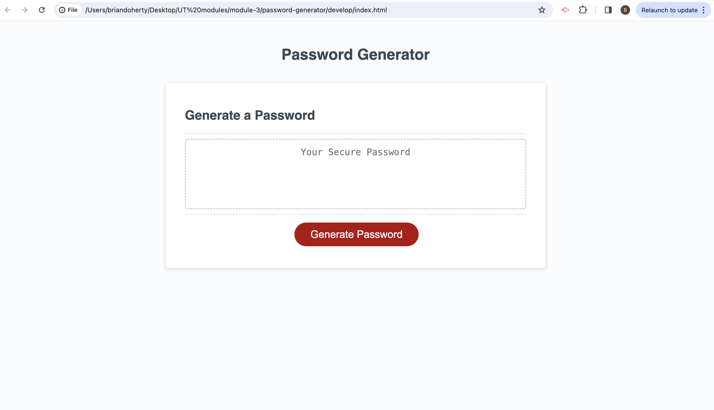

# Password Generator

## Description

This is a secure password generator application designed for employees with access to sensitive data. It allows users to generate strong and unique passwords based on their specified criteria, providing an extra layer of security for their accounts.

## Table of Contents

- [Installation](#installation)
- [Usage](#usage)

## Preview 



## Installation

Follow these steps to set up and run the application:

1. Clone the repository:

   ```bash
   git clone https://github.com/your-username/password-generator.git

## Usage
Click the "Generate Password" button.
Follow the prompts to specify password criteria.
A password matching the selected criteria will be generated and displayed in the textarea.
